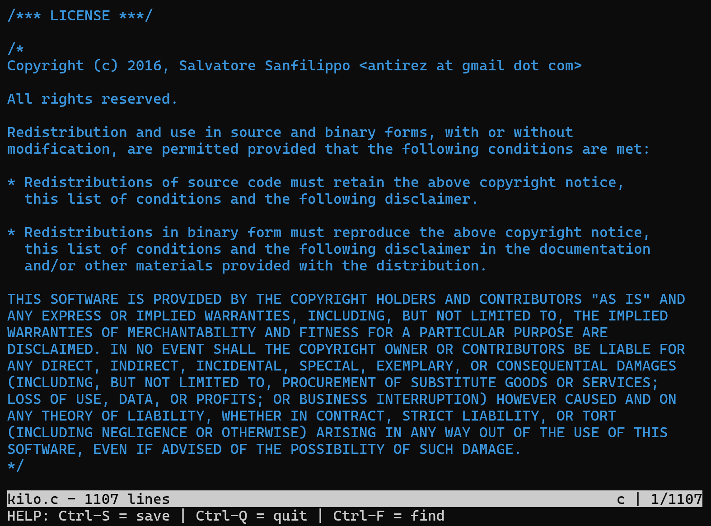
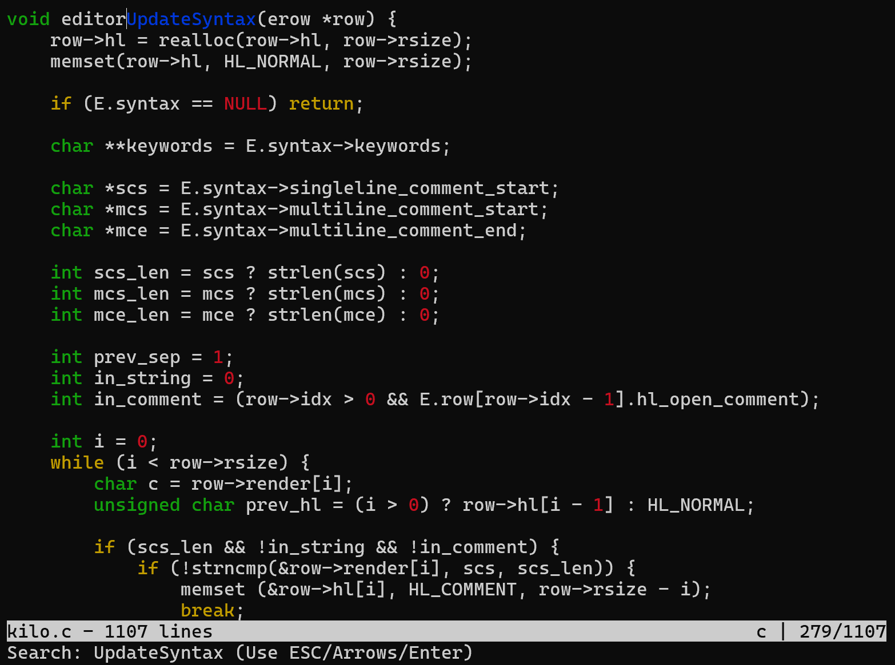

# CYB3053 kilo Scripting
## Information
This is a variation on **antirez's** [_kilo_](https://github.com/antirez/kilo) text editor.  
The script almost exactly follows **snaptoken's** walkthrough with their own variation found [here](https://viewsourcecode.org/snaptoken/kilo/index.html).  
I added a small section to highlight the "NULL" keyword.  
I will almost certainly revisit this project (and this page) in the future.  

## Code
Here is the script: [kilo.c](CYB3053-kilo.c)  

## Images
Here is the _kilo_ license viewed through the text editor:  
  

Here is the search ability (blue) and other syntax highlighting:  
  
