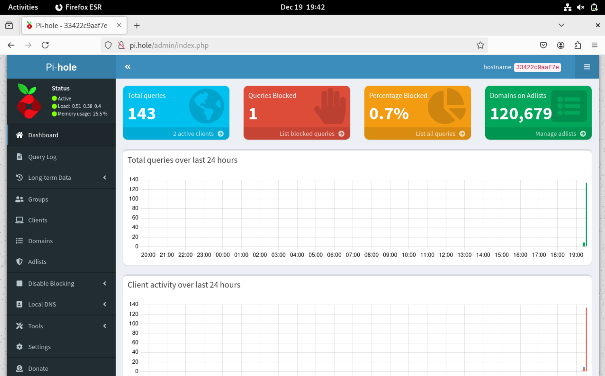

# Environment
- VirtualBox virtual machine
- 20 GB v-SSD storage
- 8000 v-DDR4 RAM
- bookworm Debian

# Docker Setup
- ensure *docker* and *docker-compose* are installed with **docker-compose**
	- the terminal returns usage options for *docker-compose*, showing that it is properly installed

# PiHole Installation
1. create *pihole/*
2. create *pihole.yml* as follows:
```
services:
  pihole:
    container_name: pihole
    image: pihole/pihole:latest
  network_mode: "host"
    ports:
      - "53:53/tcp"
      - "53:53/udp"
      - "80:80/tcp"
    environment:
      TZ: 'America/Chicago'
      WEBPASSWORD: '******'
    volumes:
      - './etc-pihole:/etc/pihole'
      - './etc-dnsmasq.d:/etc/dnsmasq.d'
    restart: unless-stopped
```
3. start the Docker container with **docker-compose up -d**

# DNS Configuration Using *resolvconf*
1. **sudo apt install resolvconf** to install the service
2. **sudo systemctl start resolvconf** to start the service
3. **sudo systemctl enable resolvconf** to enable the service to start after a reboot
4. **sudo systemctl status resolvconf** to ensure the service is running
5. update */etc/resolvconf/resolv.cond.d/head* to add `nameserver 127.0.0.1` to allow the PiHole server to use PiHole as its DNS server
6. **resolvconf --enable-updates** to allow *resolvconf* to manage updated nameservers
7. **resolvconf -u** to update nameservers

# Verify PiHole Installation
- visit `pi.hole/admin` in a web browser and log in using the *WEBPASSWORD* variable declared earlier

